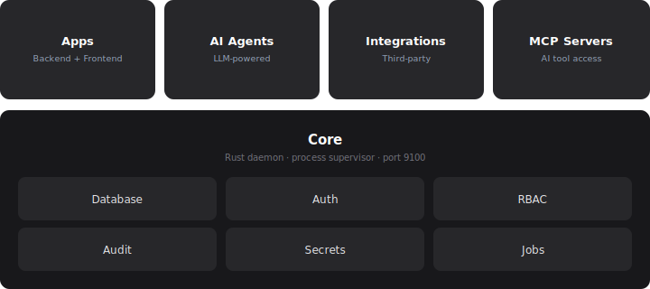

<p align="center">
  <a href="https://rootcx.com">
    
  </a>
</p>

<h1 align="center">RootCX</h1>

<p align="center">
  <a href="https://rootcx.com/docs"></a>
  <a href="https://discord.gg/W7sqMYtdws"></a>
  <a href="https://github.com/rootcx/rootcx/blob/main/LICENSE.md"></a>
  <a href="https://github.com/rootcx/rootcx/stargazers"></a>
</p>

<div align="center">
  <a href="https://rootcx.com/docs">Documentation</a>
  <span>&nbsp;&nbsp;&bull;&nbsp;&nbsp;</span>
  <a href="https://discord.gg/rootcx">Discord</a>
  <span>&nbsp;&nbsp;&bull;&nbsp;&nbsp;</span>
  <a href="https://github.com/rootcx/rootcx/issues">Issues</a>
  <span>&nbsp;&nbsp;&bull;&nbsp;&nbsp;</span>
  <a href="https://rootcx.com/docs/guides/getting-started">Get Started</a>
</div>

<br />

## What is RootCX?

RootCX is production infrastructure for internal apps and AI agents. It ships as a single server called **Core**, available as a [Docker image](https://github.com/RootCX/RootCX/pkgs/container/core) or through [RootCX Cloud](https://rootcx.com).

You build apps with your favorite AI tools ([skills available](https://skills.sh/rootcx/skills)). Core handles everything else: PostgreSQL database, SSO authentication, role-based permissions, audit logs, secrets vault, job scheduling, message queues, file storage, integrations, and deployment.

Cloud or self-hosted. Your code, your data.

## Quickstart

```bash
rootcx init
```

<p align="center">
  
</p>

`init` walks you through everything interactively: pick cloud or self-hosted, create an account, name your app, scaffold it, and deploy.

## Installation

```sh
# macOS / Linux
curl -fsSL https://rootcx.com/install.sh | sh

# Windows
powershell -c "irm https://rootcx.com/install.ps1 | iex"
```

## Claude Code

```bash
npx skills add rootcx/skills
claude
```

## Features

| | |
|---|---|
| **Database** | Shared PostgreSQL with auto-generated CRUD APIs |
| **Auth** | OIDC SSO (Okta, Microsoft Entra ID, Google Workspace, Auth0) |
| **RBAC** | Namespaced permissions, wildcard matching, role inheritance |
| **Audit log** | Every insert, update, delete captured with before/after diff |
| **Scheduled jobs** | Cron scheduling via `pg_cron` |
| **Message queue** | Durable job queue via `pgmq` with automatic retry |
| **Secrets vault** | AES-256 encrypted storage for API keys and credentials |
| **Integrations** | Notion, Gmail, Outlook, Salesforce, Slack, GitHub, Stripe, and more |
| **Agent tools** | Every app exposes tools (query, mutate, describe) for agents |
| **MCP** | Connect any MCP server to give agents access to external tools |
| **Channels** | Connect agents to Telegram, Slack, email |
| **File storage** | Upload and serve files scoped per app |

## Architecture

<p align="center">
  <picture>
    <source media="(prefers-color-scheme: dark)" srcset=".github/architecture.svg" />
    <source media="(prefers-color-scheme: light)" srcset=".github/architecture.svg" />
    
  </picture>
</p>

## Community

- [Discord](https://discord.gg/rootcx) for questions, discussion, and support
- [GitHub Issues](https://github.com/rootcx/rootcx/issues) for bug reports and feature requests
- [Documentation](https://rootcx.com/docs) for guides, references, and API docs

## License

RootCX is source-available under the [FSL-1.1-ALv2](LICENSE.md) (Functional Source License). Use, modify, and redistribute for any purpose other than offering a competing product. Converts to **Apache 2.0** after two years.
